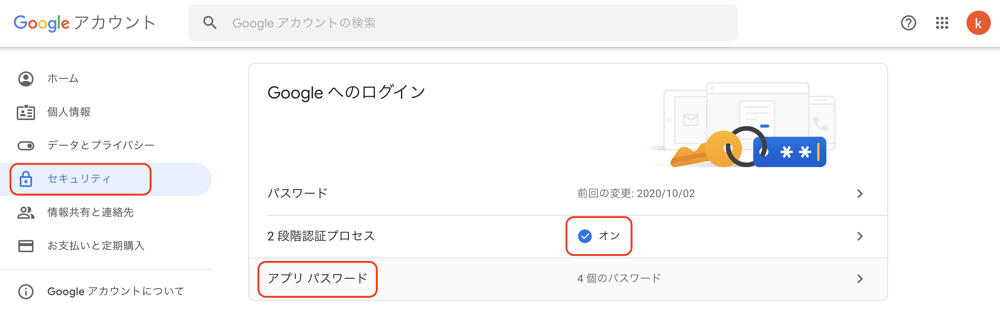
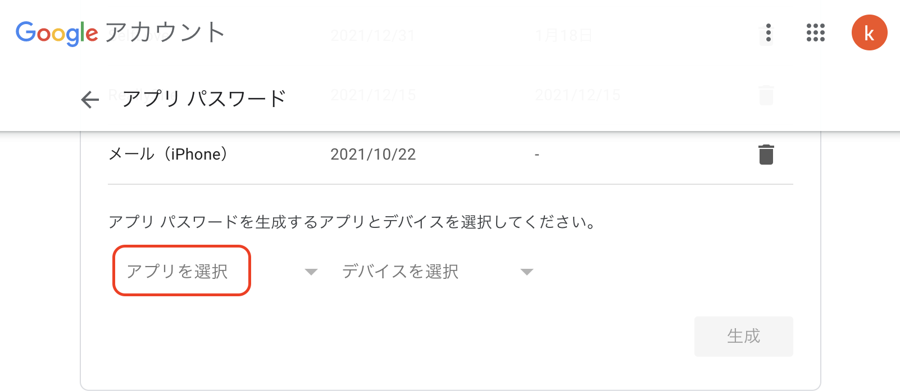
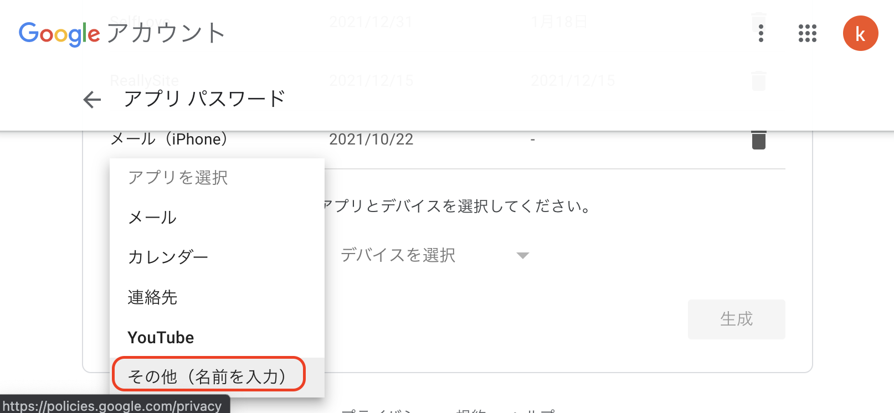
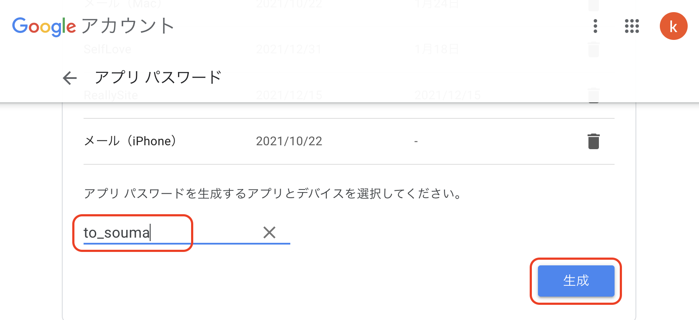
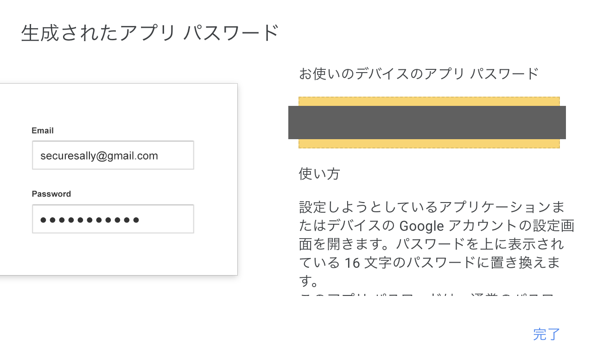

# 塾から届く授業日報が激アツだったので、まとめて残したい！ 2021/3/16
- 授業日報のコメント欄と担当の先生の部分のみ取得しまとめる
- Gmail, imapclient, streamlit使用


## 環境設定

```python
niko@kunikonoMacBook-Pro to_souma % python3 -m venv venv
niko@kunikonoMacBook-Pro to_souma % pyenv global 3.9.7
niko@kunikonoMacBook-Pro to_souma % . venv/bin/activate
```

IMAPClient（IMAPサーバー接続に利用）

```python
pip install imapclient
```

backports.ssl（SSL暗号化に利用）

```python
pip install backports.ssl
```

pyOpenSSL（SSL暗号化に利用）

```python
pip install pyOpenSSL
```
pyzmail36（メール解析に利用）

```python
pip install pyzmail36
```

```python
pip freeze > requirements.txt
```

<br>

## Gmailのアプリパスワードを作成
- Googleアカウントを開く<br>
  ここから詳細画像あり<br>
  - セキュリティを開く
  - 2段階認証プロセスをONにする
  - アプリパスワードを生成する
    - 本人確認
    - アプリを選択
    - その他を選択
    - 作るアプリの名前を入力(今回はto_souma)
    - パスワードが生成されるので控える(グレー部分)











## get_mail.ipynbで欲しい情報だけ取得

## app.pyでstreamlitに表示

